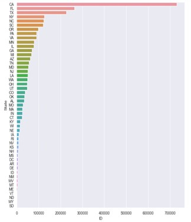
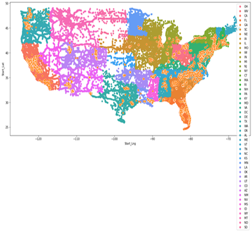
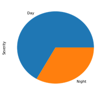
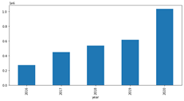
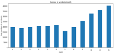
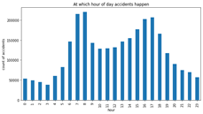

-   [Introduction](#introduction)
-   [Data Organization](#data-organization)
    -   [US Accidents Data](#us-accidents-data)
    -   [Applications of Dataset](#applications-of-dataset)
-   [Exploratory Data Analysis](#exploratory-data-analysis)
    -   [The number of accidents in each US states](#the-number-of-accidents-in-each-us-states)
    -   [The number of accidents in US states](#the-number-of-accidents-in-us-states)
    -   [The number of accidents in each half of the day](#the-number-of-accidents-in-each-half-of-the-day)
    -   [The total number of accidents in each year](#the-total-number-of-accidents-in-each-year)
    -   [The average number of accidents in each month](#the-average-number-of-accidents-in-each-month)
    -   [The total number of accidents in each hour](#the-total-number-of-accidents-in-each-hour)
    -   [The total number of accidents in each part of the day](#the-total-number-of-accidents-in-each-part-of-the-day)
-   [Conclusions](#conclusions)
-   [Code](#code)
-   [Data Sources](#data-sources)

# Introduction
Car accidents considering from one of the most problems that occurred in the recent years starting from that time that first car was made. This kind of problem has a lot of problems in different aspects such as economic, Psychological, and human souls. The economic damages that caused by the accidents are big like the damages that occurred on the cars from car metal's damages, re fix the body to re the car to its real shape; which is cause a lot of money costing on the car owner in order to fix it. The main problem of the car accidents caused is human deaths, many numbers of humans died in car accidents over the years which cause by a lot of losses on human souls and money. 
Knowing the reasons that causes the accidents have an efficient factor in order to avoid and solve car accidents reasons, and provide big and sufficient awareness of people in order to deal with the accidents and how to avoid the reasons that may cause the accidents like the vast speed, focus on the phone and social media while driving, and think about certain things other than driving.
Knowing the places that accidents occurred helps the government to provide safe facilities in these ways to help the citizens take care of them self while driving then avoiding the accidents as much as they can.
The main challenge in this kind of research is the huge amount of data used. The reason for the huge amount of data is the vast car accidents that occur every day, every hour, and every second.
Python programming language used in the paper to read, analyze, and visualize the data in an easy, understandable way using python libraries like Pandas, NumPy, Matplotlib, and Seaborn.
-	Pandas is a python library for data manipulation and analysis. It provides a data structure and operations for manipulating numerical tables [1].
-	NumPy is a python library that used in mathematical and logical operations on data [2].
-	Matplotlib is python package used for data visualization, it is a library for making 2D plots from data [3].
-	Seaborn is python library provides high level API for visualizing the data [4].

The paper asked some questions to be answered through the work, these questions represented as follows; displaying the state that has the highest number of accidents, the time that accidents usually do in the United States (US), and visualize the whole data set in one figure.
The dataset that used in the paper is a countrywide car accident dataset, which covers 49 states of the USA [5]. The accident data are collected from February 2016 to Dec 2020, using multiple APIs that provide streaming traffic incident (or event) data. These APIs broadcast traffic data captured by a variety of entities, such as the US and state departments of transportation, law enforcement agencies, traffic cameras, and traffic sensors within the road networks. Currently, there are about 3 million accident records in this dataset [6].
The remain paper workflow are as follow; Section II demonstrates the related work, Section III introduce the methodology, Section IV present the experimental results, and Section V conclude the whole study.

# Data Organization
This is a countrywide traffic accident dataset, which covers 49 states of the United States. The data is continuously being collected from February 2016, using several data providers, including multiple APIs that provide streaming traffic event data. These APIs broadcast traffic events captured by a variety of entities, such as the US and state departments of transportation, law enforcement agencies, traffic cameras, and traffic sensors within the road-networks. Currently, there are about 3 million accident records in this dataset. Check the below descriptions for more detailed information.

After filtering the data by removing the irrelevant attributes to our analysis, we ended up with the following attributes:

## US Accidents Data:

| # | Attribute | Description |Nullable|
| - | --- | --- |--- |
|1|	ID|	This is a unique identifier of the accident record.|	No|
|2|	Severity|	Shows the severity of the accident, a number between 1 and 4, where 1 indicates the least impact on traffic (i.e., short delay as a result of the accident) and 4 indicates a significant impact on traffic (i.e., long delay).|	No|
|3|	Start Time	|Shows start time of the accident in local time zone.|	No|
|4	|End_Time	|Shows end time of the accident in local time zone. End time here refers to when the impact of accident on traffic flow was dismissed.	|No|
|5|	Start_Lat|	Shows latitude in GPS coordinate of the start point.	|No|
|6	|Start_Lng	|Shows longitude in GPS coordinate of the start point.	|No|
|7|	End_Lat|	Shows latitude in GPS coordinate of the end point.	|Yes|
|8|	End_Lng	|Shows longitude in GPS coordinate of the end point.	|Yes|
|9|	Distance(mi)	|The length of the road extent affected by the accident.	|No|
|10|	Description	|Shows natural language description of the accident.	|No|
|11|	Number	|Shows the street number in address field.	|Yes|
|12|	Street	|Shows the street name in address field.	|Yes|
|13|	Side	|Shows the relative side of the street (Right/Left) in address field.	|Yes|
|14|	City	|Shows the city in address field.	|Yes|
|15|	County	|Shows the county in address field.	|Yes|
|16|	State	|Shows the state in address field.	|Yes|
|17|	Zipcode	|Shows the zipcode in address field.	|Yes|
|18|	Country	|Shows the country in address field.	|Yes|
|19|	Timezone	|Shows timezone based on the location of the accident (eastern, central, etc.).	|Yes|
|20|	Airport_Code|	Denotes an airport-based weather station which is the closest one to location of the accident.	|Yes|
|21|	Weather_Timestamp|	Shows the time-stamp of weather observation record (in local time).	|Yes|
|22|	Temperature(F)|	Shows the temperature (in Fahrenheit).	|Yes|
|23|	Wind_Chill(F)|	Shows the wind chill (in Fahrenheit).	|Yes|
|24|	Humidity(%)	|Shows the humidity (in percentage).	|Yes|
|25|	Pressure(in)	|Shows the air pressure (in inches).	|Yes|
|26|	Visibility(mi)|	Shows visibility (in miles).	|Yes|
|27|	Wind_Direction	|Shows wind direction.	|Yes|
|28|	Wind_Speed(mph|)	Shows wind speed (in miles per hour).	|Yes|
|29|	Precipitation(in)|	Shows precipitation amount in inches, if there is any.	|Yes|
|30|	Weather_Condition|	Shows the weather condition (rain, snow, thunderstorm, fog, etc.)	|Yes|
|31|	Amenity|	A POI annotation which indicates presence of amenity in a nearby location.|No|
|32|	Bump|	A POI annotation which indicates presence of speed bump or hump in a nearby location.	|Yes|
|33|	Crossing|	A POI annotation which indicates presence of crossing in a nearby location.|No|
|34|	Give_Way|	A POI annotation which indicates presence of give_way in a nearby location.|No|
|35|	Junction|	A POI annotation which indicates presence of junction in a nearby location.|No|
|36|	No_Exit|	A POI annotation which indicates presence of no_exit in a nearby location.|No|
|37|	Railway|	A POI annotation which indicates presence of railway in a nearby location.|No|
|38|	Roundabout|	A POI annotation which indicates presence of roundabout in a nearby location.|No|
|39|	Station|	A POI annotation which indicates presence of station in a nearby location.|No|
|40|	Stop|	A POI annotation which indicates presence of stop in a nearby location.|No|
|41|	Traffic_Calming	|A POI annotation which indicates presence of traffic_calming in a nearby location.|No|
|42|	Traffic_Signal|	A POI annotation which indicates presence of traffic_signal in a nearby loction.|No|
|43|	Turning_Loop|	A POI annotation which indicates presence of turning_loop in a nearby location.|No|
|44|	Sunrise_Sunset|	Shows the period of day (i.e. day or night) based on sunrise/sunset.	|Yes|
|45|	Civil_Twilight	|Shows the period of day (i.e. day or night) based on civil twilight.|Yes|
|46|	Nautical_Twilight|	Shows the period of day (i.e. day or night) based on nautical twilight.|Yes|
|47|	Astronomical_Twilight|	Shows the period of day (i.e. day or night) based on astronomical twilight.|Yes|

# Applications of Dataset
US-Accidents can be used for numerous applications such as real-time accident prediction, studying accident hotspot locations, casualty analysis and extracting cause and effect rules to predict accidents, or studying the impact of precipitation or other environmental stimuli on accident occurrence.

# Exploratory Data Analysis

## The number of accidents in each US states
The bar plot in figure (1) displayed the whole US states which covers 49 states as y-axis and the count that represents the number of accidents that occurred in each state as x-axis.
The bar plot is sorting from the highest number of accidents going to the lowest number, we can see that California is ranking as the top states with the largest number of accidents which is 730744. And   South Dakota in the end with the lowest number of accidents which is 217.

    

## The number of accidents in US states
The scatter plot in figure (2) displayed the whole US map that represents the number of accidents that occurred in the states using the latitude as the x-axis and longitude as the y-axis. 
The plot shows the states that have the greatest number of accidents like Minnesota, Wisconsin, Indiana, Tennessee, Georgia, South, North Carolina, Florida, Virginia, Pennsylvania, and New York. Generally, the states that placed in the Southwest and Northwest are the most states that accidents occurred in them. 

    

## The number of accidents in each half of the day
Based on the dataset, a groupby function used to get the severity for sunset and sunrise. As the pie chart shows in figure (3), the Day represent sunrise and the Night represent sunset, it can be stated that most of the accidents are conducted in the sunrise period, which means that the decision makers should focus on this period to take appropriate actions that prevent the increase of these accidents.

    

## The total number of accidents in each year
Moreover, the bar chart in figure (4) shows that accidents which happened in US states for the period from 2016 until 2020, and it can be stated that the number of accidents is moving increasingly year by year, where the year 2020 has the highest number of accidents in comparison with the other years.

    
   

## The average number of accidents in each month
Furthermore, the bar chart in figure (5) shows the average number of accidents which happened in US states for the period from 2016 until 2020 per month. Based on the results, the number of accidents is moving constantly, and start increasing after the 7th month of the year, which be explained by the different situations that makes people go to the streets and shops and other places because of several events, besides that the highest number of accidents occurs in the 12th month which includes the new year event that people use to go out and make festivals. Hence, the decision makers should take proper actions to prevent the accidents in that time.

    

## The total number of accidents in each hour
In addition, the bar chart in figure (6) shows the average number of accidents which happened in US states for the same period per hour. Based on the results, the highest number of accidents is occurred in two periods, which are 7-8 AM – the beginning of work for employees - and 4-5 PM – the end of work for employees - which can be considered as a critical time, in which the decision makers should take proper actions to stop increasing the number of accidents in it.

    

## The total number of accidents in each part of the day
Finally, the bar chart in figure (7) shows the average number of accidents which happened in US states for the same period per day parts. Based on the results, the forgoing facts are proved well, because it can seen that afternoon and morning parts of day have the highest number of accidents in comparison with the other parts, which are; morning and night

    

# Conclusions
The US is one of the most crowded countries in the world, and that is the actual reason for the increasing number of accidents in its states. In this work, we made a deep investigation to a dataset of the US accidents for the period from 2016 until 2020. We have utilized Python programming language to make some visualizations that helps to extract some of the hidden facts. Based on the results, we found that California was the state that has the highest number of accidents, and the states that in the southwest and northwest areas are the most states that have more and more accidents. Also, the US accident occurs at morning and afternoon at 7-8 and 4-5 hours, besides that the end of each year has the highest number too. Moreover, the total number of accidents moving increasingly, year by year, which makes our research efficient to put the spotlight on these facts, in order to help the decision makers to avoid having more accidents and find new solutions:

# Code

*Please note that since the US-Accident dataset we are using is too big, it was not convienient to download and import it to Google Drive or Github.*

## Task1
import pandas as pd

import seaborn as sns

import matplotlib.pyplot as plt

df = pd.read_csv('C:/Users/FARIS/Desktop/archive/US_Accidents_Dec20_Updated.csv')

df.head()

print(df.columns)

numberOfAccidents = df[["ID", "State"]].groupby("State").count().sort_values("ID", ascending=False)

numberOfAccidents

import warnings

warnings.simplefilter(action="ignore", category=FutureWarning)

sns.barplot(numberOfAccidents["ID"], numberOfAccidents.index)

sns.set(rc={"figure.figsize":(10, 8)})

x = numberOfAccidents["ID"]

y = numberOfAccidents.index

plt.figure(figsize=(15, 5))

display(plt.plot(y,x))

plt.xlabel('states')

plt.ylabel('Number of accidents')

plt.show()

## Task2
import pandas as pd

import numpy as np

import matplotlib

import seaborn as sns

%matplotlib inline

from sklearn.preprocessing import LabelEncoder

import matplotlib.pyplot as plt 

Data=pd.read_csv('US_Accidents_Dec20_Updated.csv')

df = pd.DataFrame(Data)

df.drop(['End_Lat', 'End_Lng', 'Number', 'Wind_Chill(F)','Precipitation(in)'], axis=1, inplace=True)

df.dropna(axis=0)

df.head()

plt.figure(figsize =(10,5))

df.groupby(['Sunrise_Sunset'])['Severity'].size().sort_values(ascending=False).plot.pie()

import datetime as dt

df['Start_Time']= pd.to_datetime(df['Start_Time']
)
df['hour']= df['Start_Time'].dt.hour

df['year']= df['Start_Time'].dt.year

df['month']= df['Start_Time'].dt.month

df['week']= df['Start_Time'].dt.week

#df['day']= df['Start_Time'].dt.weekday_name

df['quarter']= df['Start_Time'].dt.quarter

df['time_zone']= df['Start_Time'].dt.tz

df['time']= df['Start_Time'].dt.time

plt.figure(figsize =(10,5))

df.groupby(['year']).size().sort_values(ascending=True).plot.bar()
plt.figure(figsize =(15,5))

df.groupby(['month']).size().plot.bar()

plt.title('Number of accidents/month')

plt.ylabel('Avg number of accidents')

dd = df['month']

dd['m'] = df['year']

dd

plt.figure(figsize =(10,5))

df.groupby(['hour']).size().plot.bar()

plt.title('At which hour of day accidents happen')

plt.ylabel('count of accidents')

df['day_zone'] = pd.cut((df['hour']),bins=(0,6,12,18,24), labels=["night", "morning", "afternoon", "evening"])

plt.figure(figsize =(10,5))

df.groupby(['day_zone']).size().plot.bar()

## Task3 

import numpy as np

import pandas as pd

import matplotlib.pyplot as plt

import seaborn as sns

read_US_dataset = pd.read_csv('US_Accidents_Dec20.csv')

US_accident_data_frame = pd.DataFrame(read_US_dataset)

plt.figure(figsize=(18, 8))

sns.scatterplot(x ='Start_Lng',y='Start_Lat', data=US_accident_data_frame , hue='State')

# Data Sources
- [US-Accidents Dataset](https://www.kaggle.com/sobhanmoosavi/us-accidents)
- Moosavi, S. [*US Accidents (3.5 million records)*](https://www.kaggle.com/sobhanmoosavi/us-accidents), Version 6. 2020 
- Moosavi, S. [*US Accidents (3.5 million records)*](https://www.kaggle.com/sobhanmoosavi/us-accidents), Version 6. 2020
